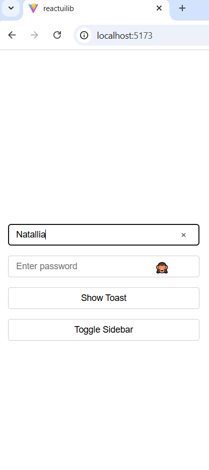
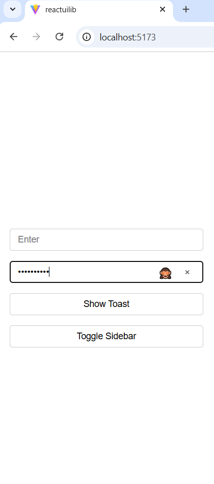
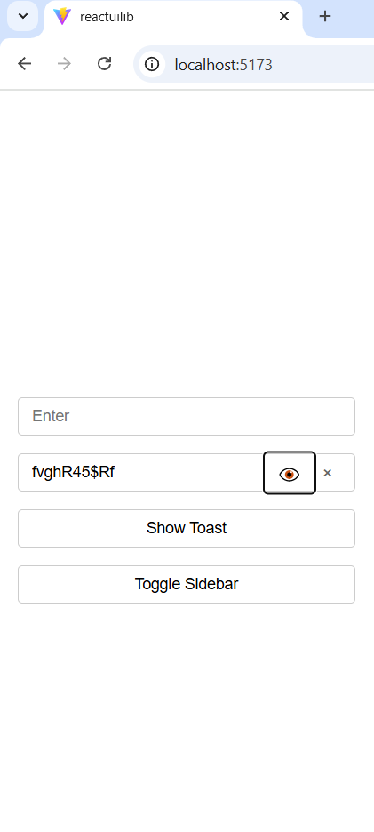
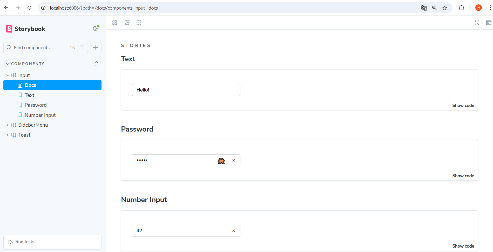
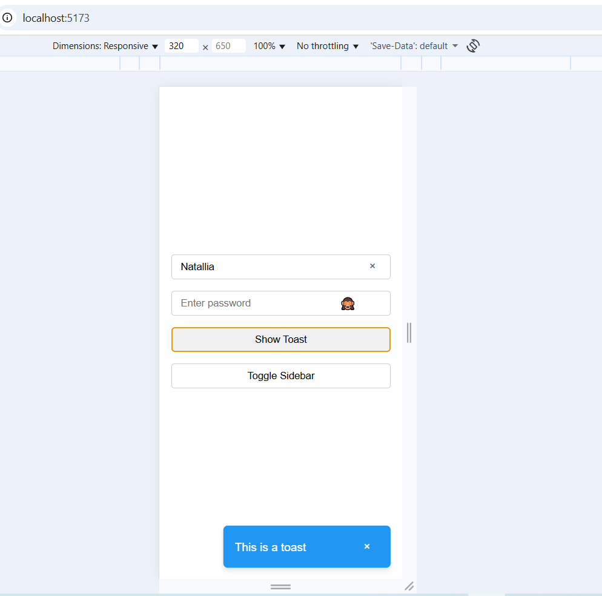
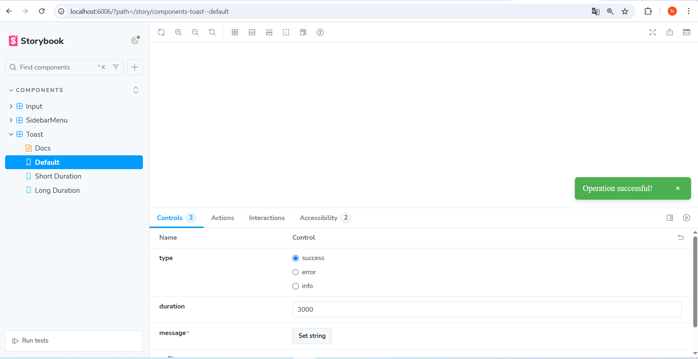
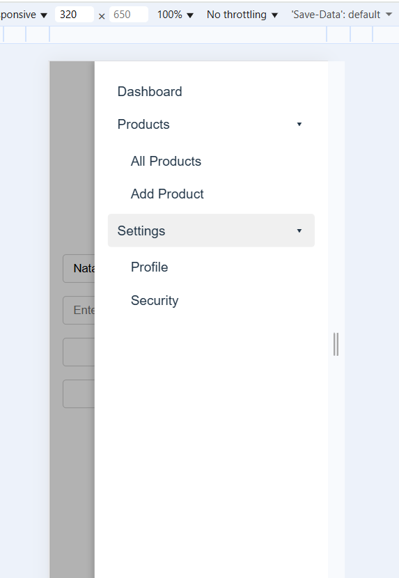
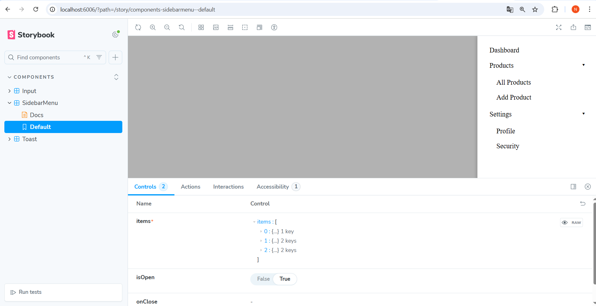

# React Component Test Assessment

This is a small **React component** created as a test assessment. It includes three reusable UI components, displayed and tested in **Storybook** with various states and props.

---

## 🎯 Overview

The project demonstrates:

- A smart `Input` component (multi-type, password visibility toggle, clearable)
- A `Toast` notification component
- A nested `Sidebar Menu` with sliding animation

All components are shown in **Storybook** with visual variations. Screenshots of different states are included below.

---

## 🚀 Components

### 1. Input Component

- **Behavior**
  - `type="password"`: eye icon toggles visibility
  - `clearable=true`: small "X" button clears input
- **Storybook**
  - Text, password (hidden/visible), number
  - With and without `clearable`

**Screenshots:**

  
  
  
  

---

### 2. Toast Component

- **Behavior**
  - Appears at the bottom right
  - Auto-dismisses after `duration`
  - Optional manual close button
  - Includes slide/fade animation
- **Storybook**
  - Variants for `success`, `error`, `info`
  - Different durations
  - Manual close button optional

**Screenshots:**

  
  

---

### 3. Sidebar Menu Component

- **Behavior**
  - Slides in from the right
  - Renders nested submenus (accordion/expandable)
  - Closes when background is clicked
- **Storybook**
  - 1-level and 2-level nested items
  - Open/closed states

**Screenshots:**

  
  

---

## ⚙️ Setup Instructions

1. Clone the repository:

```bash
git clone https://github.com/yourusername/react-component-library.git
cd react-component-library
Install dependencies:

bash
Копировать код
npm install
# or
yarn install
Run Storybook:

bash
Копировать код
npm run storybook
# or
yarn storybook
Open the browser at http://localhost:6006 to see all components.

📂 Folder Structure
css
Копировать код
src/
├── assets/
│   └── screenshots/
├── components/
│   ├── Input/
│   ├── Toast/
│   └── SidebarMenu/
├── stories/
└── index.ts
✅ Features Implemented
Input with password toggle & clearable functionality

Toast notifications with auto-dismiss and manual close

SidebarMenu with sliding, nested items, and backdrop close

Fully integrated with Storybook Controls for live props editing

CSS animations for better UX

🔗 Submission
The repository is public on GitHub.

Screenshots included in README.md.

Storybook fully functional locally.

📦 Bonus Points
@storybook/addon-controls used for live editing

Smooth CSS transitions for Toast and SidebarMenu

Modular and reusable React components

🧪 Review Criteria
Code readability and modularity

Proper use of props and state

Creative UI implementation

Storybook documentation and controls

